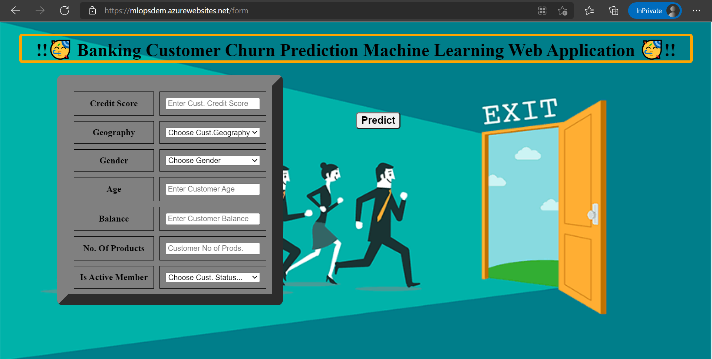

## Banking Customer Chrun Prediction Machine Learning Web App. - Decision Tree Model and Deployed Web App

## Project Purpose: 
To demonstrate a full ML Model deployment to a web app using Microsoft Azure webapp service.

## Business Case: 
Banks want to know which customers are going to exit in future due to some reasons like not proper support, offers, services, etc.

So they want to create a model that accurately predicts whether a customer going to leave bank in future or not so that Bank can give some special offers to retain them.

## Goal: 
Bank need to know which customers are going to exit in future or not. 

## Deliverable: 
A web app that end users(Bank Employees & Managers) can utilize to whether a customer going to leave bank in future or not using a Decision Tree model on the backend.

**1. Web App:** [Click here for Live Web App!!](https://mlopsdem.azurewebsites.net/form)  

    url-> https://mlopsdem.azurewebsites.net/form
[**Warning:-** This link may not work sometimes as I used free azure account, so don't know for how much long it get deployed.]

  

### Repository Structure:
~~~~~~~
    |-- .github/workflows - Automatically created folder while deoploying using Azure & Choosing Provider as GitHub Actions in deployment center.
                          - It basically contains the Work Flow of deployment 
    |-- templates         - Folder contains index.html & output.html pages of front end. 
    |-- main.py           - main python file contains FastAPI deployment code.
    |-- model.pkl         - ML Model for deployment.
    |-- requirements.txt  - File contains names of required libraries with their versions.
    |-- startup.sh        - Startup file which contains command to activate Uvicorn server in Azure Deployment Environment.
    |-- transformer.pkl   - Transformer which transforms some columns in our ML Model.
~~~~~~~

### Steps to Deploy Web App code into Azure Webapp service.
~~~~~~~
1. Goto https://portal.azure.com
2. Create a *Resource Group* first.
3. Create a *Web App resouce* instance with normal configurations.
4. After Web App resouce creation go to that *Web App resource*.
5. On left side panel, go to *Settings* & open *Configuration*.
6. In Configuration select *Major version* as *Python 3* & *Minor version* as *Python 3.7* & finally in *Startup Command* type *startup.sh* 
(This startup.sh is a file which contains a command to start Uvicrosn Server in Azure Environment & this is automatically taken from git hub repo.)
7. Now goto *Deployment* Section in the same left pannel & choose *Deployment Center*.
8. In *Deployment Center* in *Settings* Tab select Source as *GitHub* & just below that *Github option* there is an option to select *Provider* there we can leave as it is as *GitHub Action*
(when we go with GitHub Action, it will create a folder *.github/workflows* in repo. as mentioned above) or can choose *WebApp*.
9. Now in below section after *Source* Login to Your Github Account & Choose the directory where the deployment code exist & Click on *Save*. 
10. Now goto the *Logs* tab which is on the left of the above *Settings* Tab, there we are able to see the Current Deployment process running.
11. After getting a *Status* as *Success(Active)* go to Browse option on top tab & click on it, it will goto the deployed app url.
~~~~~~~

## Results and Web App Demo: 
Finally our ML Model is deployed on Microsoft Azure using Microsoft Azure WebApp Service.
Now Bank Employees and Managers are able to see the results for the customers of their bank who are plaining to leave bank in future.

### Here is web app live demo.
https://user-images.githubusercontent.com/40027119/198020151-5a6dcc97-243f-4747-9596-33b510f74d8f.mp4

## Business Impact: 

End users (Bank Employees & Managers) will be able to use the web app built off of this ML model that accurately predicts whether a customer going to leave bank in future or not. 

So that Bank can give some special offers to retain them or plan some diff ways to retain the customers.

This will speed up the manual retension process and allow the bank to make more loyal customers in less time, resulting in more clients and revenue. 

### Next Steps: Monitor performance and retrain model with more data as more data becomes available.

### **🥳Thank & Regards,🥳**
### **Mr. Tanmaya Chaudhary,**
### **Data Scientist @ Ernst & Young LLP**
### **Email- tanmaychaudhary95@gmail.com**
